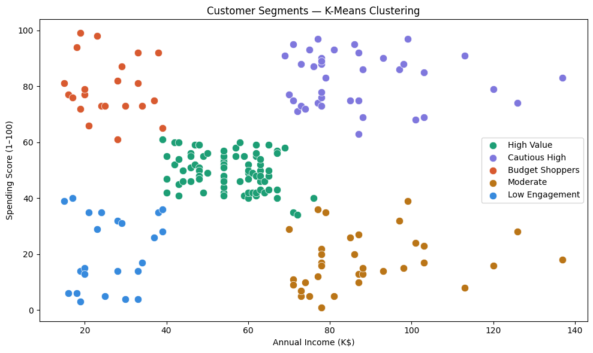
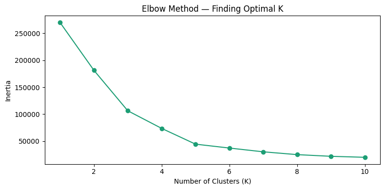

# customer-segmentation
Customer Segmentation using K-Means Clustering | Python | Scikit-learn
# Customer Segmentation using K-Means Clustering

## Overview
Analyzed mall customer data to group 200 customers into 5 distinct 
segments using K-Means clustering in Python.

## Tools Used
Python, Pandas, NumPy, Scikit-learn, Matplotlib, Seaborn

## Key Steps
- Loaded and explored dataset (200 customers, 5 features)
- Used Elbow Method to find optimal K = 5
- Applied K-Means clustering
- Evaluated model with Silhouette Score: 0.55
- Visualized customer segments by Income vs Spending Score

## Results
| Segment | Avg Income | Avg Spending | Strategy |
|---------|-----------|--------------|----------|
| High Value | $88K | 78/100 | Loyalty rewards |
| Cautious High | $82K | 18/100 | Premium offers |
| Budget Shoppers | $28K | 76/100 | Discounts |
| Moderate | $55K | 49/100 | Upsell |
| Low Engagement | $35K | 20/100 | Low priority |

## Visualizations

